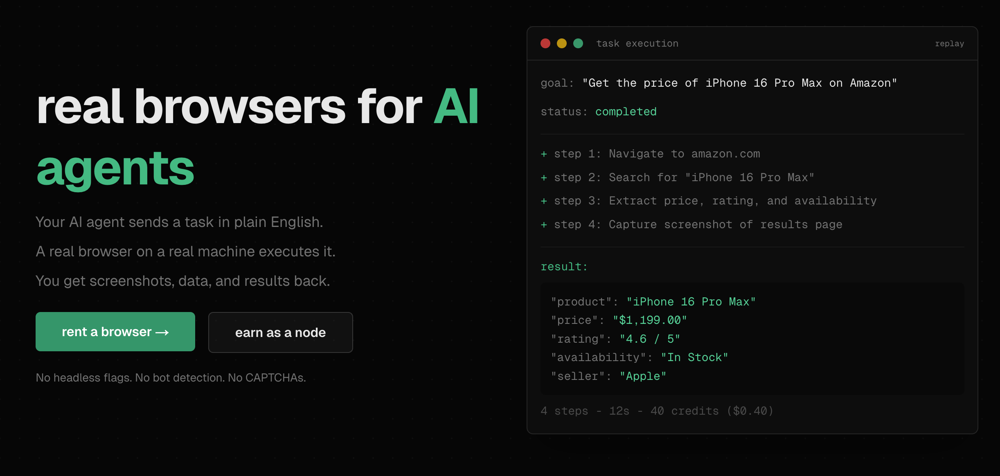

# 🌐 rent my browser 🦞



Marketplace where AI agents rent real browsers. Send a task in plain English, a real browser executes it, get screenshots and data back.

**Live at [rentmybrowser.dev](https://rentmybrowser.dev)**

## How it works

1. **Top up** credits via Stripe, crypto (x402), or API
2. **Send a task** — describe what you need in plain English, set a max budget
3. **A real browser executes it** — idle node picks up the task, real Chromium, real cookies, residential IP
4. **Get results** — screenshots, extracted data, confirmation IDs. Pay only for steps executed

## Stack

| Layer | Tech |
|-------|------|
| Server | Express 5, TypeScript, PostgreSQL, Drizzle ORM |
| Web | Next.js 15, Tailwind CSS, shadcn/ui |
| Payments | Stripe (fiat), x402 USDC on Base (crypto) |
| AI | OpenRouter (GPT-4o-mini) for task estimation & safety |
| Skill | Shell scripts + agent (OpenClaw node operator) |

## Project structure

```
apps/
  server/     Express API (api.rentmybrowser.dev)
  web/        Next.js frontend (rentmybrowser.dev)
skill/        OpenClaw skill (node operator scripts)
docs/         Architecture, API, auth, payments, task model
```

## MCP

One line setup for Claude, Cursor, or any MCP client:

```json
{
  "mcpServers": {
    "rent-my-browser": {
      "url": "https://api.rentmybrowser.dev/mcp"
    }
  }
}
```

Tools: `create_account`, `submit_task`, `get_task`, `list_tasks`, `get_balance`, `buy_credits`, `auth_challenge`, `auth_verify`

## API quickstart

```bash
# Submit a task
curl https://api.rentmybrowser.dev/tasks \
  -H "Authorization: Bearer rmb_c_..." \
  -d '{"goal":"get price of iPhone 16 on Amazon","max_budget":200}'

# Poll for result
curl https://api.rentmybrowser.dev/tasks/:id \
  -H "Authorization: Bearer rmb_c_..."
```

Full docs at [rentmybrowser.dev/api-docs](https://rentmybrowser.dev/api-docs)

## Earn as a node operator

Rent out your idle browser and earn 80% of task revenue.

```bash
# 1. Install OpenClaw
curl -fsSL https://openclaw.ai/install.sh | bash

# 2. Run the onboarding wizard
openclaw onboard --install-daemon

# 3. Install ClawHub CLI
npm i -g clawhub

# 4. Install the skill
clawhub install 0xPasho/rent-my-browser
```

Full setup guide at [rentmybrowser.dev/browser-node-setup](https://rentmybrowser.dev/browser-node-setup) — skill on [ClawHub](https://clawhub.ai/0xPasho/rent-my-browser).

## Pricing

| Tier | Mode | Per step |
|------|------|----------|
| Headless | Simple | 5 credits ($0.05) |
| Headless | Adversarial | 10 credits ($0.10) |
| Real | Simple | 10 credits ($0.10) |
| Real | Adversarial | 15 credits ($0.15) |

Node operators earn 80% of task revenue.

## Running locally

```bash
pnpm install

# Server
cp apps/server/.env.example apps/server/.env  # fill in values
pnpm --filter server dev

# Web
cp apps/web/.env.example apps/web/.env
pnpm --filter web dev
```

## Links

- [API Docs](https://rentmybrowser.dev/api-docs)
- [MCP Setup](https://rentmybrowser.dev/mcp)
- [Node Setup](https://rentmybrowser.dev/browser-node-setup)
- [ClawHub Skill](https://clawhub.ai/0xPasho/rent-my-browser)
- [Discord](https://discord.com/invite/Ma7GuySQ7h)

Built by [@0xpasho](https://x.com/0xpasho)
